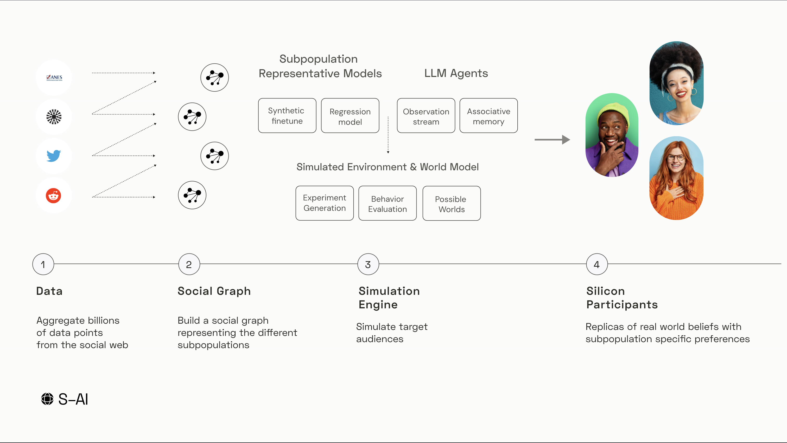

<div align="center">

</div>
<br/>

<h4 align="center">
    <a href="https://discord.gg/RjG64szFDR">
        
    </a>
</h4>


<p align="center">
    <p align="center">Building the simulation engine to enable social system simulations.
    <br>
    <br>
    <a href="https://github.com/simulatrex/simulatrex/issues/new?assignees=&labels=enhancement&projects=&title=%5BFeature%5D%3A+">Feature Request</a>
</p>

## How?



### Multi-Agent Simulation Framework

If you are looking for our multi-agent simulation framework, we moved it [here](https://github.com/simulatrex/possible-worlds).


## Contributing
To contribute: Clone the repo locally -> Make a change -> Submit a PR with the change. 

Here's how to modify the repo locally: 
Step 1: Clone the repo 
```
git clone https://github.com/simulatrex/simulatrex-engine
```

Step 2: Navigate into the project, setup a new virtual env (recommended) and install dependencies: 
```
cd simulatrex
python -m venv venv
source venv/bin/activate
pip install -r requirements.txt
```

Step 3: Submit a PR with your changes! 🚀
- push your fork to your GitHub repo
- submit a PR from there 

# Support / talk with founders
- [Community Discord 💭](https://discord.gg/THG27uRm)
- Email ✉️ dom@simulatrex.com
