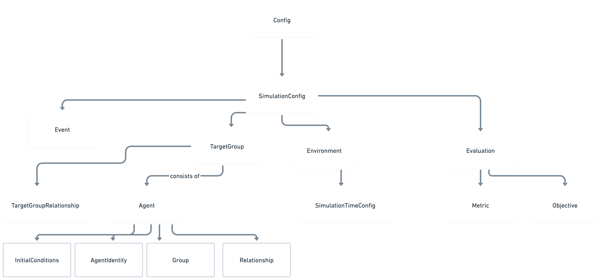

The simulation config consists of the following entities:

<figure>
  <picture>
    <source
      srcset="../assets/simulation-config-dark.png"
      media="(prefers-color-scheme: dark)"
    />
    
  </picture>
  <figcaption>Simulation Config</figcaption>
</figure>

## Supported versions

 Version | Description |
---------|-------------|
 0.1     | Initial version of the simulation config |
 0.1.1   | Introduced support for target groups |
