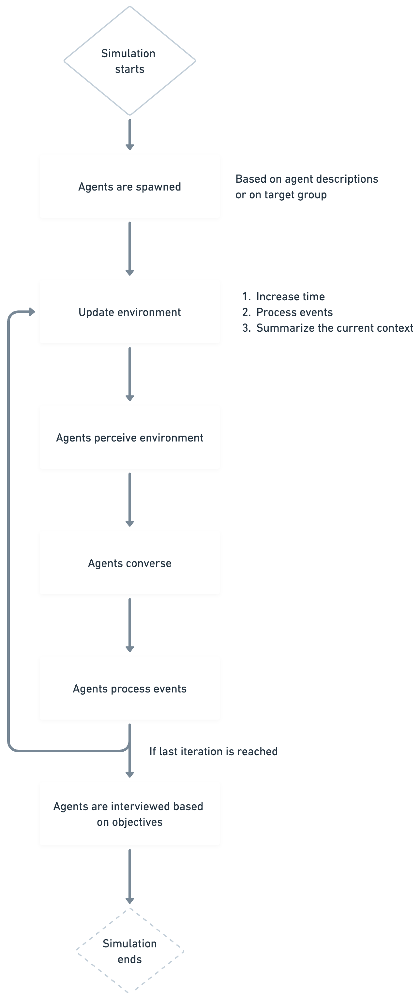

# Simulatrex Architecture

Simulatrex is a powerful simulation framework that utilizes Large Language Models (LLMs) to create multi-agent simulations. It is designed to cater to the needs of social sciences and market research, providing a robust platform for complex simulations.

## Flow Chart

<figure>
  <picture>
    <source
        srcset="../assets/simulation-architecture-dark.png"
        media="(prefers-color-scheme: dark)"
        />
    
  </picture>
</figure>
